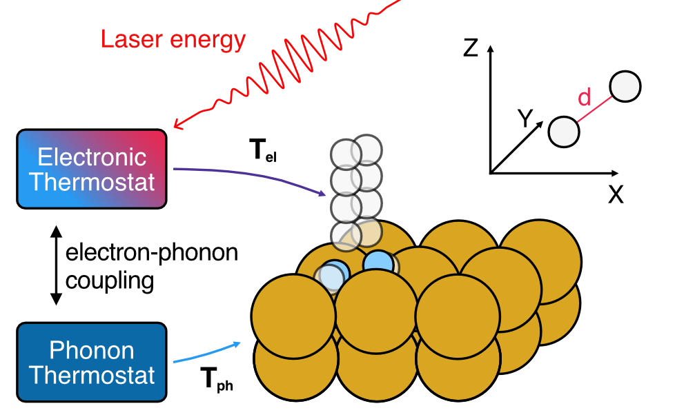
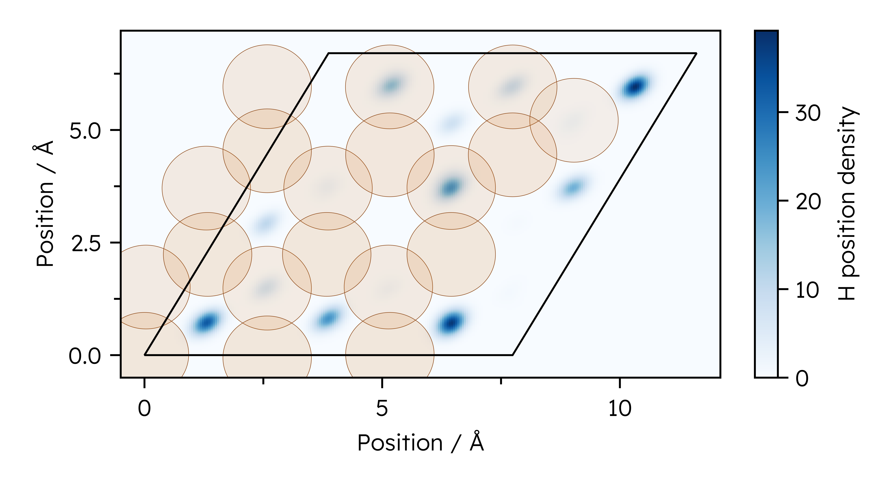
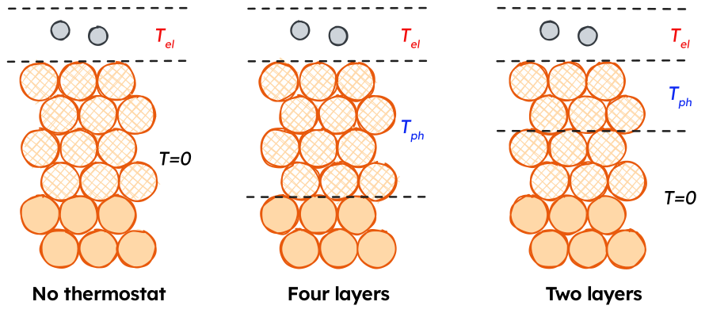

{width="75%"}

# Simulating laser-driven desorption with MDEF and the TTM

:::{.callout-note}

This page focuses on using the model combination tools in NQCDynamics.jl and NQCModels.jl to perform MDEF simulations with separate thermostats for different parts of the system. 
The page on Molecular Dynamics with Electronic Friction in the main documentation contains more information on MDEF as a method, and is a better starting point if you are trying out the method for the first time. 

*This is where links to my papers go once they're done.*

:::


## Introduction

On this page, we will look at the example of simulating the response of hydrogen adsorbed to a Cu(111) surface to an ultrafast laser pulse using Molecular Dynamics with Electronic Friction and the Two-temperature model.

As detailed before, the nuclear coordinates in MDEF evolve as follows:
$$
\mathbf{M}\ddot{\mathbf{R}} = - \nabla_R V(\mathbf{R}) + \mathbf{F}(t) - \Gamma(\mathbf{R}) \dot{\mathbf{R}}
$$
The first term on the right hand side of the equation corresponds to a conservative force associated with the potential energy surface (PES) as in the adiabatic case. The third term is the friction force and it comes from multiplication between the electronic friction object ($\Gamma(\mathbf{R})$) and the velocity.
Finally, the second term is a temperature and friction-dependent stochastic force which ensures detailed balance.

## The two-temperature model

:::{.callout-note}
Temperature profiles for the Two-temperature model can be generated using the [LightMatter.jl](https://github.com/maurergroup/LightMatter.jl) package. (Will be released soon)
:::

The two-temperature model (TTM) is a system of two coupled differential equations that describe the time evolution of the electronic and lattice temperatures, $T_{el}$ and $T_{ph}$. In this work, lateral heat transport across the metal surface is neglected, allowing for a simplified one-dimensional representation of the two-temperature model. The TTM is given by the following set of equations: 

**Electronic heat capacity**
$$
C_{el}\frac{\partial}{\partial t}T_{el}=\nabla(\kappa\nabla T_{el})-g(T_{el}-T_{ph})+S(z,t) 
$$

**Phononic heat capacity**
$$
C_{ph}\frac{\partial}{\partial t}T_{ph}=g(T_{el}-T_{ph}) 
$$

**Laser source term**
$$
S(z,t)=F\cdot\frac{\exp{\frac{-z}{\xi}}\cdot\exp{\frac{-(t-t_0)^2}{2r^2}}}{\xi\cdot\sqrt{2\pi}\tau}; 
		\tau=\frac{\mathrm{FWHM}}{2\sqrt{2\ln{2}}}
$$

The model is parametrised with material-specific parameters obtained from ab-initio calculations or experiments. As an example, the material-specific parameters for bulk crystalline Cu are shown here ([Scholz2019](@cite)):

| Parameter				| Explanation													| Value											|
|-----------------------|---------------------------------------------------------------|-----------------------------------------------|
| $g$					| Electron-phonon coupling constant								| $1\times 10^{-17}~\mathrm{W~m^{-3}~K^{-1}}$	|
| $\xi$				| Laser penetration depth for $\lambda=400~\mathrm{nm}$		| $\frac{1}{\xi}=14.9~\mathrm{nm}$			|
| $\gamma_{el}$		| Scaling constant for the electronic heat capacity $C_{el}$.	| $98.0~\mathrm{J~m^{-3}~K^{-2}}$				|
| $\theta_D$			| Debye temperature of Cu.										| $343~\mathrm{K}$							|
| $N$					| Atom density of bulk Cu										| $8.5\times 10^{28}$							|
| $\kappa_{RT}$		| Thermal conductivity at room temperature						| $401.0~\mathrm{W^{-1}~K^{-1}}$				|
| $\mathrm{FWHM}$		| Full width half maximum of the laser pulse					| $150~\mathrm{fs}$							|


The electronic heat capacity $C_{el}(T_{el})$ was determined using a linear scaling relation:

$$
C_{el}(T_{el})=\gamma_{el}T_{el} 
$$

The temperature dependence of the thermal conductivity of Cu was modelled using the following relation:

$$
\kappa(T_{el}, T_{ph})=\kappa_{RT}\frac{T_{el}}{T_{ph}}
$$

The phononic heat capacity was calculated using the Debye model with $N$ and $\theta_D$ values given above:

$$
C_{ph}(T_{ph})=9nk_B\left(\frac{T_{ph}}{\theta_D}\right)^3\int_0^{\frac{\theta_D}{T_{ph}}}\frac{x^4e^x}{(e^x-1)^2}~dx
$$


An example of the TTM progression for a $80~\mathrm{J~m^{-2}}$ absorbed fluence is shown in the video below. 


In our implementation of the TTM, the temperature progressions are saved to CSV files, which need to be interpolated to provide a continuous temperature function to use for our `Simulation`s. 

```julia
using BSplineKit
using Unitful, UnitfulAtomic
using CSV, DataFrames

"""
This function reads a CSV file for a TTM solution containing:
1. The time in ps
2. Electronic temperature
3. Phononic temperature

Depending on which index is specified, a continuous temperature function for the electronic or phononic temperature is returned. 
"""
function T_function_from_file(file::String, index::Int=2)
	TTM_file = CSV.read(file, DataFrame)
	T_spline = interpolate(TTM_file.Time, TTM_file[:, index], BSplineOrder(4)) # is a cubic spline
	T_extrapolation = extrapolate(T_spline, Smooth()) #! Don't use to go earlier than the first point!
	T_function(time_ps) = T_extrapolation(ustrip(u"ps", time_ps)) * u"K"
	return T_function
end

T_el_function = T_function_from_file("ttm-file.csv", 2)
T_ph_function = T_function_from_file("ttm-file.csv", 3)
```

## Models

In the following, we use machine learning interatomic potentials from Stark *et al.* to predict energies, forces and electronic friction tensors. These will be needed multiple times in the remaining tutorial, so we define functions to load them here. 

```julia
using MACEModels
using FrictionProviders

"""
Function to load the MACE models used in this tutorial.
"""
function load_mace_model()
	atoms, position, cell = read_extxyz("starting_structure.xyz")
	
	# Load PES model
	pes_model = MACEModel(
		atoms,
		cell,
		["mace-model.model"];
		device="cpu",
		default_dtype=Float32,
		mobile_atoms::Vector{Int}=18:56, # Keep the top 4 layers mobile, freeze the bottom 2. 
	)
	return pes_model
end

function load_ldfa_eft_ace()
	## Create ACE LDFA model
	# We need to make a copy of our structure containing only one H atom to evaluate the density
	atoms, positions, cell = read_extxyz("starting_structure.xyz")
	positions_copy = deepcopy(positions)
	H_indices = sort(findall(atoms.types .== :H); rev=true)
	indices_to_copy = symdiff(1:lastindex(atoms.types), H_indices[2:end])
	single_H_atoms = Atoms(atoms.types[indices_to_copy])
	single_H_positions = positions_copy[:, indices_to_copy]
	write_extxyz("single_H_structure.xyz", single_H_atoms, single_H_positions, cell)
	# Now we load the single H copy and the LDFA model
	julip_atoms = ACEpotentials.read_extxyz("single_H_structure.xyz")[1] # Hacky workaround to avoid using python more
	eft_model = ACEpotentials.read_dict(ACEpotentials.load_dict("ace_ldfa_H2Cu.json")["IP"])
	JuLIP.set_calculator!(julip_atoms, eft_model)
	density_model = AceLDFA(AdiabaticModels.JuLIPModel(julip_atoms); density_unit=u"Å^-3")
	ldfa_model = LDFAFriction(density_model, atoms; friction_atoms=H_indices)
	return ldfa_model
end
```


## Generating initial conditions

Initial conditions are generated by Metropolis-Hastings Monte Carlo sampling of atomic positions. All Cu(111) structures were generated with a temperature-dependent lattice constant interpolated from NPT ensemble MD trajectories at different temperatures.^@starkMachineLearningInteratomic2023a^

For a unit cell size of $3\times 3\times 6$ layers, structures with two and four H atoms were generated with the atoms located in the hollow adsorption sites. For each combination of temperature and coverage, an evenly spaced sample of 100000 structures was taken from a single random walk, discarding the first 1000 steps due to similarity to the starting configuration. Additional parameters for the Monte Carlo sampling are given in the following code block.


```julia
function thermal_montecarlo(parameters)
	# Import starting structure
	atoms, position, cell = read_extxyz("starting_structure.xyz")
	
	# Load PES model
	pes_model = load_mace_model()
	simulation = Simulation{Classical}(
		atoms,
		pes_model;
		cell = cell,
		temperature = 100.0u"K",
	)
	
	simulation.atoms.types[1:18] .= :X
	step_sizes = Dict(
		:H => 3.0, # High step size to have a chance of traversing diffusion barriers. 
		:Cu => 0.075, # Step size close to kT. 
		:X => 0.0, # No movement for frozen atoms
	)
	# Now start MC sampling
	mc_chain = InitialConditions.ThermalMonteCarlo.run_advancedmh_sampling(
		simulation, # Simulation to run HMC sampling with
		positions, # Initial configuration
		100000, # Number of MonteCarlo steps to do.
		step_sizes; # Step sizes per atom species.
		movement_ratio = 2/56, # on average, move two atoms per step
		thinning = 15, # Record only every 15 steps to capture fewer similar structures
		discard_initial = 10000, # Ignore the first 10000 structures as they are too similar to the starting structure
	)
	
	nqcd_distribution = DynamicalDistribution(
		VelocityBoltzmann(100.0u"K", simulation),
		mc_chain,
		sim
	)
	jldsave("initial_conditions.jld2"; nqcd_distribution = nqcd_distribution) # Save as a JLD2 file to reload later. 
end
```

{width="100%"}

## Setting up a single simulation

### Conditional termination of simulations on desorption

Since we want our laser-driven desorption simulations to terminate once a H2 molecule has definitely desorbed, we need to write a termination condition for the simulation. 

We consider a H2 molecule as desorbed if it is more than a certain distance away from the top layer of the surface, where the cutoff radius of the MACE MLIP will ensure it can't return to the surface. The code snippet below shows how this can be achieved with a DiffEq callback which is used later in the tutorial, which also works for an arbitrary amount of H atoms on the surface to allow for desorption detection at different coverages. 

```julia
using Parameters

@with_kw mutable struct DesorptionTerminator
	hydrogen_indices
	top_layer_indices::Vector{Int}
	min_desorption_distance = 8.0
	simulation::NQCDynamics.AbstractSimulation
end

"""
	(desorption_terminator::DesorptionTerminator)(u,t,integrator)::Bool

	DesorptionTerminator checks whether any combination of `hydrogen_indices` has a centre of mass distance larger than `min_desorption_distance` from `cu_surface_z`.
"""
function (desorption_terminator::DesorptionTerminator)(u, t, integrator)::Bool
	# Find possible hydrogen molecules from all unique distance combinations of H atoms.
	h_combinations = collect(multiset_combinations(desorption_terminator.hydrogen_indices, 2)) # Unique H neighbour list
	surface_z = cu_surface_z(u, desorption_terminator.top_layer_indices)
	for molecule in h_combinations
		if NQCDynamics.Structure.pbc_center_of_mass(u, molecule..., desorption_terminator.simulation; cutoff=1)[3] - surface_z >= ang_to_au(desorption_terminator.min_desorption_distance) # Check if H2 COM is far enough away from the surface COM
			return true
		end
	end
	return false
end
```

### Combining Electronic and phononic thermostats

The electron and phonon temperatures are propagated as described above, yielding temperature profiles that are applied to MDEF simulations through the ``\mathcal{W}`` term in the Langevin equation.
``T_{el}`` is applied directly to the adsorbate H atoms, while ``\gamma`` as a function of H positions is determined using one of the MLIPs detailed above. 
``T_{ph}`` is coupled to the surface Cu atoms using a position-independent coupling constant.



As shown above, ``T_{ph}`` can enter our system in different ways. We will use [`Subsystem`](@ref)s to generate a [`CompositeModel`](@ref) and [`Simulation`](@ref) for these different strategies. 

### Electron thermostat only

```julia
# PES applies to all atoms
pes_subsystem = Subsystem(pes_model)

# Electronic friction applies to adsorbate atoms 55,56
electronic_friction = Subsystem(load_ldfa_eft_ace(), indices=[55,56])

# Combine models and generate Simulation
combined_model = CompositeModel(pes_subsystem, electronic_friction)

sim_T_el_only = Simulation{MDEF}(
	atoms, 
	combined_model; 
	temperature = T_el_function, 
	cell=cell
)
```

### Phonon thermostatting top four layers
```julia
# PES applies to all atoms
pes_subsystem = Subsystem(pes_model)

# Electronic friction applies to adsorbate atoms 55,56
electronic_friction = Subsystem(load_ldfa_eft_ace(), indices=[55,56])

# Phononic friction applies to surface atoms 18:54
γ_phonon = austrip(uconvert(u"ps^-1", 97694097465737.3 * u"rad/s" / 2 / π / u"rad")) * austrip(101.07u"u") # Friction coefficent based on Debye frequency. 
phononic_friction = Subsystem(ConstantFriction(size(positions,1), γ_phonon), indices=18:54)

# Combine models and generate Simulation
combined_model = CompositeModel(
	pes_subsystem, 
	electronic_friction, 
	phononic_friction
)

# Create TemperatureSetting objects to apply T_el to adsorbates, T_ph to surface
# Manually specified indices
electron_thermostat = TemperatureSetting(T_el_function, indices = [55,56]) 
# Inherit indices from a Subsystem
phonon_thermostat = TemperatureSetting(T_ph_function, phononic_friction) 

sim_T_el_only = Simulation{MDEF}(
	atoms, 
	combined_model; 
	temperature = [
		electron_thermostat,
		phonon_thermostat
	], 
	cell=cell
)
```

### Running the simulation

```julia
thermostats = TemperatureSetting[]
subsystems = Subsystem[Subsystem(pes_model, 1:size(initial_positions,2))]
# Apply phonon thermostat to selected atoms
T_ph_function = T_function_from_file(parameters["2TM-file"], 3)
phonon_indices = 1:54
push!(thermostats, TemperatureSetting(T_ph_function, phonon_indices)) # Apply T_ph profile
push!(subsystems, Subsystem(ConstantFriction(size(initial_positions,1), parameters["γ_phonon"]), phonon_indices)) # Apply phononic friction

T_el_function = T_function_from_file(parameters["2TM-file"], 2)
atom_indices = [55,56]
push!(thermostats, TemperatureSetting(T_el_function, atom_indices)) # Assign T_el profile
push!(subsystems, Subsystem(EFT_model, atom_indices)) # Apply electronic friction

remaining_atoms = symdiff(1:size(initial_positions)[2], [t.indices for t in thermostats]...) # Should be empty
if remaining_atoms != [] # If any atoms aren't assigned to a thermostat, make them classical.
	push!(thermostats, TemperatureSetting(0.0, remaining_atoms))
end
complete_model = CompositeModel(subsystems...) # Build model for simulations
@info "Generated PES (+Friction) model with thermostats"
# Setup simulation and termination condition.
# Initialise NCQD Simulation
simulation = Simulation{MDEF}(
	atoms,
	complete_model;
	cell = cell,
	temperature = thermostats
)

nqcd_distribution = jldopen("initial_conditions.jld2")["nqcd_distribution"]


desorption_callback = DesorptionTerminator([55,56], collect([46:54]), 6.0, simulation)
terminate_callback = DynamicsUtils.TerminatingCallback(desorption_callback)
outputs = (OutputDesorptionTrajectory, OutputDesorptionAngle, OutputFinalTime, )
saveat = 0.1u"fs"
GC.gc()
traj = run_dynamics(
	simulation,
	(0.0u"fs", 4.75u"ps"),
	nqcd_distribution;
	dt = 0.1u"fs",
	trajectories = 1,
	output = outputs,
	callback = CallbackSet(
		DynamicsUtils.CellBoundaryCallback(), # This wraps around periodic boundary conditions. 
		terminate_callback # This stops the simulation on desorption. 
	),
	saveat=saveat_arg,
	savetime = false, # Don't save the time at each step, it makes trajectories take up less space. 
)
jldsave("trajectory.jld2", results = results, parameters = parameters)
```


## Scaling up for HPC systems. 


## Analysing results


